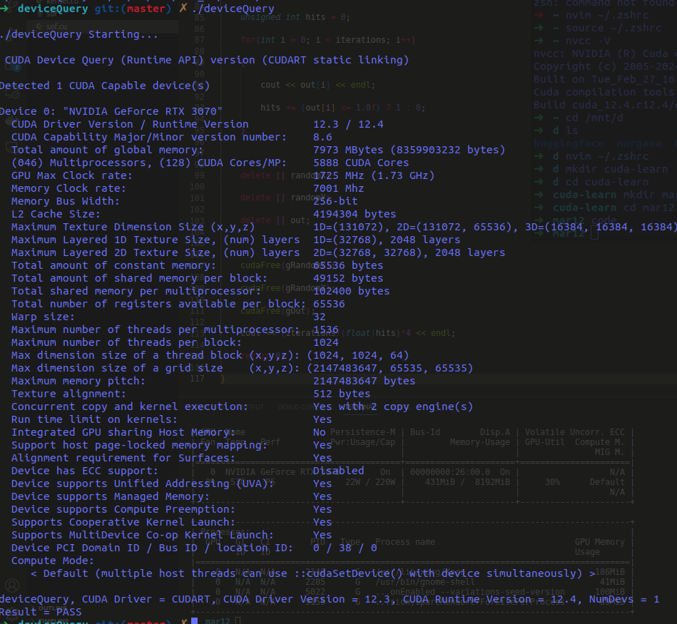
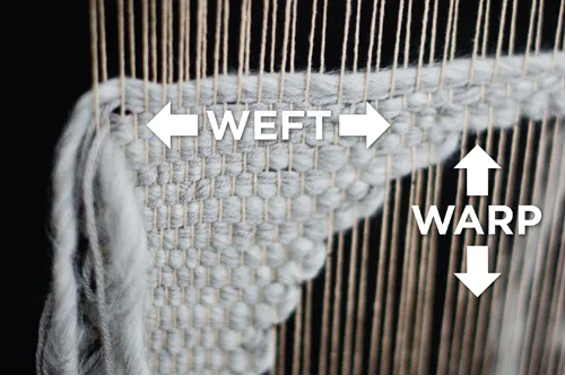
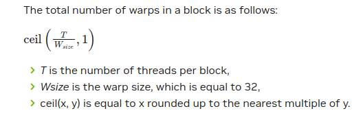

# CUDA 基础 (CUDA Basics)

## 📊 打印你的 GPU 硬件状态信息


---

## 💡 简单名词解释
* **主机端 (Host)** ⇒ 指的是 CPU，使用主板上的物理内存（DRAM 内存条）。
* **设备端 (Device)** ⇒ 指的是 GPU，使用显卡芯片上的板载显存（VRAM）。

### CUDA 程序的高层级运行逻辑：
1. **数据拷贝 (H2D)**：将输入数据从主机端内存拷贝到设备端显存。
2. **加载并运行**：将编译好的 GPU 程序（核函数）加载到 GPU，并利用已拷贝的显存数据进行大规模并行计算。
3. **数据拷回 (D2H)**：计算完成后，将结果从设备端显存拷贝回主机端内存，以供 CPU 使用或显示。

---

## 🛠️ 主机端与设备端命名规范 (Host vs Device Naming)
* 变量名前缀 `h_` 表示该变量位于主机端（CPU）。例如：`h_A`。
* 变量名前缀 `d_` 表示该变量位于设备端（GPU）。例如：`d_A`。

---

## 🏷️ 函数声明修饰符 (Function Qualifiers)
* **`__global__`（核函数 / Kernel）**：
  * **可见性**：对 CPU 和 GPU 全局可见，由主机端（CPU）调用，在设备端（GPU）上执行。
  * **返回值**：必须是 `void`（不能有直接返回值）。它的计算结果需要通过参数中传入的显存指针传回。
  * **用途**：这就是我们的 CUDA Kernel，负责执行主要的并行计算。
* **`__device__`（设备函数）**：
  * **可见性**：只能由设备端（GPU）的核函数或其它设备函数调用，在设备端上运行。
  * **用途**：相当于 GPU 上的内部库函数。例如，如果 `__global__` 核函数要对注意力矩阵（Attention Matrix）应用标量掩码（Scalar Masking），可以把这个具体运算封装在 `__device__` 函数中被多次调用，避免把所有代码都堆在核函数里。
* **`__host__`（主机函数）**：
  * **可见性**：只能由 CPU 调用并在 CPU 上运行，与传统的 C/C++ 普通函数完全一致（不写任何修饰符时默认即为 `__host__`）。

---

## 💾 显存管理 (Memory Management)
* **`cudaMalloc`**：在 GPU 全局内存（Global Memory/VRAM）上分配指定字节大小的空间：
  ```cpp
  float *d_a, *d_b, *d_c;
  cudaMalloc(&d_a, N * N * sizeof(float));
  cudaMalloc(&d_b, N * N * sizeof(float));
  cudaMalloc(&d_c, N * N * sizeof(float));
  ```
* **`cudaMemcpy`**：在 Host 和 Device 之间传输数据，常用方向包括：
  * 主机端到设备端 (Host to Device) ⇒ `cudaMemcpyHostToDevice`
  * 设备端到主机端 (Device to Host) ⇒ `cudaMemcpyDeviceToHost`
  * 设备端到设备端 (Device to Device) ⇒ `cudaMemcpyDeviceToDevice`
* **`cudaFree`**：释放已分配的设备端显存空间。

---

## ⚙️ `nvcc` 编译器工作流
* **Host 代码 (主机端代码)**：由 `nvcc` 分离，调用 C++ 编译器（如 MSVC/gcc）编译为普通的 CPU 机器码。
* **Device 代码 (设备端代码)**：由 `nvcc` 编译为 **PTX (Parallel Thread Execution)** 汇编代码。
  * PTX 是一种通用的虚拟指令集，在多代 GPU 架构之间保持稳定。
* **JIT (即时编译 / Just-in-Time)**：在程序运行时，GPU 驱动会将 PTX 代码即时编译为当前 GPU 硬件的物理指令（SASS），从而确保了程序的**向前兼容性**。

---

## 📐 CUDA 线程层级结构 (CUDA Hierarchy)
1. **Thread（线程）**：执行核函数的最小计算实体。
2. **Block（线程块）**：由多个线程组成的群组。
3. **Grid（网格）**：由多个线程块组成的群组。
4. **综上**：一个 Kernel 启动时，表现为一个 Grid，内部包含多个 Blocks，每个 Block 包含多个 Threads。

### 核心坐标变量 (4 个内置技术术语)：
* `gridDim`：网格的维度（当前 Grid 中包含的 Block 数量）。
* `blockIdx`：当前 Block 在整个 Grid 中的索引。
* `blockDim`：线程块的维度（当前 Block 中包含的 Thread 数量）。
* `threadIdx`：当前 Thread 在其所属 Block 内部的相对索引。

---

## 🧵 线程 (Threads)
* 每个线程拥有自己独立的寄存器（Register）和局部内存（Local Memory），这些内存对其它线程是不可见的。
* **例如**：在进行数组加法 `c = a + b` 时，线程 0 计算 `a[0] + b[0]`，线程 1 计算 `a[1] + b[1]`，以此类推。

---

## 📦 线程束 (Warps)

* **术语来源**：Warp（经线）和 Weft（纬线）是纺织业中的概念，指在织布机上纵向拉伸并固定的纱线束。
* **物理定义**：**Warp 是 GPU 硬件调度和执行的最小单位**。一个 Warp 包含 32 个物理线程。
* **控制机制**：指令是分发给整个 Warp 的，Warp 内部的 32 个线程以 **SIMT（单指令多线程）** 的方式锁步（lockstep）执行相同指令。
* **硬件结构**：每个 SM（流多处理器）内部包含 4 个 **Warp Scheduler（线程束调度器）**，负责对就绪的 Warps 进行轮流调度。


---

## 🧱 线程块 (Blocks)
* **共享内存 (Shared Memory)**：每个线程块拥有自己专属的 Shared Memory，该 Block 内的所有线程都可以访问并共享这块片上高速缓存。
* **协同优势**：在对相同的数据进行不同计算时，利用共享内存可以大幅减少对全局显存的访问次数，提高读写吞吐量。

---

## 🌐 网格 (Grids)
* 整个核函数启动对应的全部线程群。所有的 Blocks 和 Threads 都可以访问全局显存（VRAM）。
* **应用示例**：在进行批处理时，Grid 可以代表整个 Batch 的任务，其中的每一个 Block 独立负责处理一个 Batch 元素。

> **为什么不直接用一个巨大的“一维 Thread 数组”，而是分成 Block 和 Grid？**
> 因为 GPU 的物理资源是分级管理的。Warp（32线程）需要锁步执行；同一个 Block 内的线程被限制在同一个 SM 内运行以便共享片上缓存（Shared Memory）并进行块内同步（`__syncthreads()`）；而 Block 之间则必须完全独立。

* **高可扩展性 (Scalability)**：
  CUDA 的并行性具有极高的可扩展性，因为 **Block 之间没有固定的执行顺序依赖**。这意味着 GPU 并不需要按 Block 0 -> Block 1 -> Block 2 顺序执行，它们完全可以乱序并发运行（例如先运行 Block 3 和 Block 0，再运行 Block 6 和 Block 1）。这也使得同一个 CUDA 代码在拥有更多 SM 核心的高端显卡上能自动获得线性加速。

---

> [推荐阅读：线程是如何映射到 CUDA 核心上的？](https://stackoverflow.com/questions/10460742/how-do-cuda-blocks-warps-threads-map-onto-cuda-cores)
