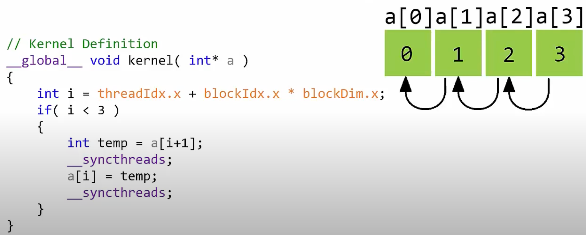
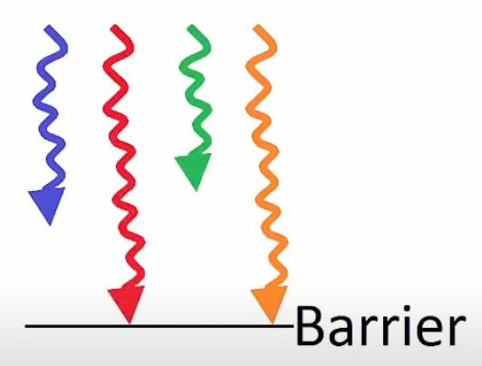

# 核函数 (Kernels)

## 📐 核函数启动参数 (Kernel Launch Params)

* **`dim3` 类型**：一个用于指定网格（Grid）和线程块（Block）维度的三维无符号整型结构体，用于配置核函数的执行参数。它支持将元素按向量（1D）、矩阵（2D）或体积/张量（3D）进行索引配置：
  ```cpp
  dim3 gridDim(4, 4, 1);   // X 维度 4 个 block，Y 维度 4 个 block，Z 维度 1 个 block（共 16 个 block）
  dim3 blockDim(4, 2, 2);  // 每个 block 内部：X 维度 4 线程，Y 维度 2 线程，Z 维度 2 线程（共 16 线程）
  ```

* **`int` 类型（一维向量）**：如果配置是一维线性索引，也可以直接传入普通的整数类型：
  ```cpp
  int gridDim = 16;   // 16 个 block
  int blockDim = 32;  // 每个 block 包含 32 个线程
  myKernel<<<gridDim, blockDim>>>(...);
  ```
  *(注：即使传入普通整数，CUDA 运行时内部仍会将其转换为三维对应的 `dim3(16, 1, 1)` 和 `dim3(32, 1, 1)`。)*

* **线程总数计算**：
  * 网格内的 Block 总数 = `gridDim.x * gridDim.y * gridDim.z`
  * 每个 Block 内部的 Thread 总数 = `blockDim.x * blockDim.y * blockDim.z`
  * 整个核函数启动的物理总线程数 = `Block 总数 * 每个 Block 的 Thread 总数`

* **执行配置格式**：核函数启动时使用的 `<<<gridDim, blockDim, Ns, S>>>` 参数说明：
  * **`gridDim` (dim3)**：指定网格的维度和大小。
  * **`blockDim` (dim3)**：指定每个线程块的维度和大小。
  * **`Ns` (size_t)**：指定每个 Block 动态分配的共享内存（Shared Memory）的字节数（默认值为 0，通常省略）。
  * **`S` (cudaStream_t)**：指定该核函数关联的 CUDA 流（Stream），是一个可选参数，默认值为 0（代表默认流/同步流）。

> [参考来源：理解 CUDA 核函数启动参数](https://stackoverflow.com/questions/26770123/understanding-this-cuda-kernels-launch-parameters)

---

## 🔒 线程同步 (Thread Synchronization)

由于 GPU 线程是完全并发且无序执行的，我们必须在必要的节点建立栅栏（Barrier）来确保数据一致性：

* **`cudaDeviceSynchronize()`（全局设备同步）**：
  * **作用**：让**主机端（CPU）**等待**设备端（GPU）**上当前排队的所有任务执行完毕。这相当于一个 CPU-GPU 间的物理栅栏。
  * **调用位置**：在主机端的 `main()` 函数或普通的 `__host__` 函数中调用。
* **`__syncthreads()`（块内线程同步）**：
  * **作用**：在核函数**内部**设置一个执行栅栏。**同一个 Block 内的所有线程**在继续运行前，必须全部到达此指令处等齐。
  * **应用场景**：当线程之间需要协同读写相同的内存位置时。例如，如果线程 A 已经完成了对某个共享内存位置的写入，而线程 B 运行较慢，如果线程 B 在线程 A 写完之前就试图读取该位置，或者在线程 A 读完之前就覆盖写入了它，就会发生数据竞争和数值计算错误。
* **`__syncwarp()`（Warp 内线程同步）**：
  * **作用**：同步同一个 Warp（32个线程）内部的所有活跃线程，确保它们在继续执行前完成数据共享和内存读写。
* **为什么需要同步**？因为不同线程在硬件上的执行顺序是异步且随机的。如果后面的操作依赖于前面的计算结果（例如先计算乘法再加 1），就必须插入同步屏障，确保所有计算逻辑符合数学优先级。

  

  

---

## 🛡️ 线程安全 (Thread Safety)

* [CUDA 是否是线程安全的？](https://forums.developer.nvidia.com/t/is-cuda-thread-safe/2262/2)
* **线程安全**是指一段代码可以同时被多个主机 CPU 线程安全调用，而不会导致 race conditions（数据竞争）或不符合预期的行为。
* **数据竞争（Race Conditions）**：指的是多个线程并发访问同一块内存，且至少有一个访问是写入，从而导致写操作覆盖或读出脏数据的现象。在 CUDA 中，我们使用同步函数（如 `cudaDeviceSynchronize()`）来保证前一个指令的全部线程都处理完毕后，再派发下一个指令。
* 若涉及从多个 CPU 线程同时调用不同的 GPU 核函数，请参考上方的链接。

---

## ⚡ SIMD 与 SIMT (单指令多线程)

* [CUDA 能使用 SIMD 指令吗？](https://stackoverflow.com/questions/5238743/can-cuda-use-simd-extensions)
* 类似于 CPU 的 SIMD（单指令多数据），GPU 采用的是 **SIMT (Single Instruction, Multiple Threads，单指令多线程)** 架构。
* 在 GPU 上，我们不需要让 `for` 循环顺序执行，而是让每一个线程去计算该循环的一次迭代，使成百万次迭代看起来只花了一次迭代的运行时间。如果循环迭代次数多于 GPU 物理计算核心数，执行时间会随着硬件饱和呈线性级数增长。
* **GPU 架构相对 CPU 更简单**：
  * 顺序指令分发（In-order instruction issue）。
  * 没有复杂的分支预测器（No branch prediction）。
  * 去掉了大量 CPU 复杂的控制单元，从而为 GPU 芯片腾出了极大的空间，用来塞入数以万计的**物理计算核心（Cores）**。

> 稍后在矩阵乘法优化部分，我们将学习并实践与 Warp 级底层原语有关的优化：[Warp 级原语 (Warp Level Primitives)](https://developer.nvidia.com/blog/using-cuda-warp-level-primitives/)

* 根据官方文档的 [Thread Hierarchy](https://docs.nvidia.com/cuda/cuda-c-programming-guide/index.html#thread-hierarchy)，每个线程块的线程数量是有上限的（因为同一个 Block 内的全部线程必须驻留在同一个 SM 上，共享有限的寄存器和 Shared Memory 资源）。在现代 GPU 上，**每个 Block 的最大线程数为 1024 个**。即：每 warp 32 线程，每个 Block 最多 32 个 warps。

---

## 🧮 硬件数学函数 (Math Intrinsics)

* GPU 硬件上针对基础数学计算提供了专属的设备端底层指令。
* 官方文档链接 -> [CUDA Math API Guide](https://docs.nvidia.com/cuda/cuda-math-api/index.html)
* **优化建议**：在核函数内部应使用针对单精度优化的设备级函数（如 `logf()`），如果错用为 CPU 设计的双精度 `log()`，会导致编译器插入额外的指令将其降级，从而拖慢速度。
* **nvcc 编译选项**：
  * `-use_fast_math`：可以让编译器自动将通用数学计算转换为设备级的硬件快速数学函数，从而极大地提高计算速度，代价是带来极小且几乎可忽略的精度损失。
  * `--fmad=true`：启用乘加融合（Fused Multiply-Add），将 `a * b + c` 融合成一条硬件指令执行，不仅速度更快，而且因为只有一次舍入误差，精度反而更高。
