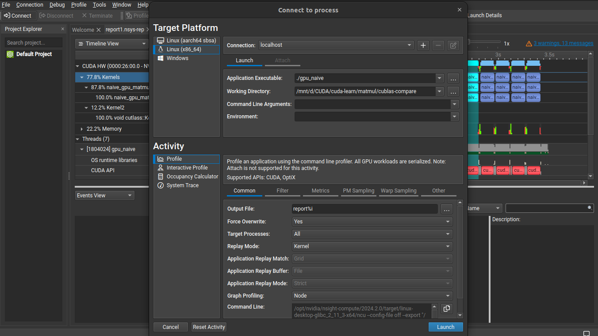
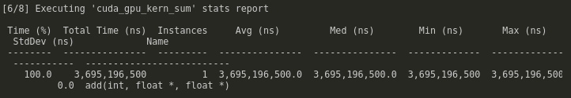
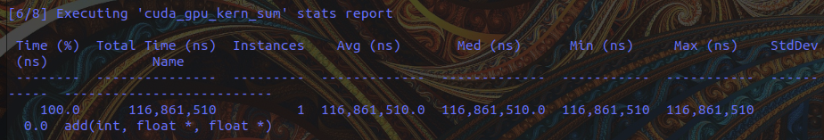
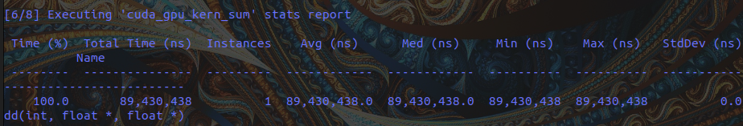

# 如何对 CUDA 核函数进行性能分析 (How to Profile your CUDA kernels)

## 🚀 性能分析实践步骤
1. **编译并分析 NVTX 矩阵乘法**：
   ```bash
   nvcc -o 00 00_nvtx_matmul.cu -lnvToolsExt
   nsys profile --stats=true ./00
   ```
   *(注：在 Windows 上，您可以将生成的 `.nsys-rep` 文件拖入 Nsight Systems GUI 界面进行可视化分析。而在 Linux 上，您也可以通过 SQLite 数据库文件 `.sqlite` 导出数据做更深度的自定义分析)*

2. **编译并分析朴素矩阵乘法**（[01_naive_matmul.cu](./01_naive_matmul.cu)）：
   ```bash
   nvcc -gencode arch=compute_120,code=sm_120 -o 01 01_naive_matmul.cu
   nsys profile --stats=true ./01
   ```

3. **编译并分析共享内存（分块）矩阵乘法**（[02_tiled_matmul.cu](./02_tiled_matmul.cu)）：
   ```bash
   nvcc -gencode arch=compute_120,code=sm_120 -o 02 02_tiled_matmul.cu
   nsys profile --stats=true ./02
   ```

---

## 🖥️ 命令行监控工具 (CLI Tools)
用于在运行期间实时观察 GPU 资源占用和利用率的工具：
* **`nvitop`**：非常美观且功能强大的交互式 GPU 监控命令行工具（推荐）。
* **`nvidia-smi`** 或实时监控命令 `watch -n 0.1 nvidia-smi`。

---

## 🔍 NVIDIA Nsight Systems & Nsight Compute

* 旧版的 `nvprof` 已经被 NVIDIA 弃用，取而代之的是更加强大的 **`nsys`**（Nsight Systems）和 **`ncu`**（Nsight Compute）。
* **分析总体命令**：
  ```bash
  nsys profile --stats=true ./main
  ```
  
* **性能分析策略建议**：
  * **第一步**：始终优先使用 **Nsight Systems (nsys)** 进行高层级分析，找出系统的性能瓶颈（是 CPU-GPU 传输限制，还是 CPU 准备太慢），并定位耗时占比最高的核心核函数。
  * **第二步**：针对定位出的耗时核函数，使用 **Nsight Compute (ncu)** 进行更底层的微架构分析，查看其寄存器使用率、内存合并访问瓶颈、SM 占用率（Occupancy）等，进而优化代码。
  * [StackOverflow 参考讨论](https://stackoverflow.com/questions/76291956/nsys-cli-profiling-guidance)
* **命令行统计提取**：
  * 使用 `nsys stats file.nsys-rep` 可以从报告中以文本图表形式定量提取各项性能指标。
  * 使用 `nsys analyze file.sqlite` 可进行定性分析。
  * 打开 GUI 分析：直接启动 `nsight-sys` (或在 Nsight Systems GUI 中)，选择 `File -> Open` 打开 `.nsys-rep` 报告文件。
* **分工定位**：
  * **`nsys` (Nsight Systems)**：侧重于全局高层级的系统调用分析（System-level tracing）。
  * **`ncu` (Nsight Compute)**：侧重于单个核函数微架构级别的内核指标详查（Kernel-level profiling）。
  * 对 Python 脚本进行分析：
    ```bash
    nsys profile --stats=true -o mlp python mlp.py
    ```
* **解决 NCU 权限拒绝（Permission Issue）**：
  在 Linux 下运行 `ncu` 收集性能计数器时，可能会遇到权限拒绝的报错（`ERR_NVGPUCTRPERM`）。
  * **解决方法**：编辑配置文件 `sudo nano /etc/modprobe.d/nvidia.conf`，在文件中添加一行 `options nvidia NVreg_RestrictProfilingToAdminUsers=0`，然后重启计算机使之生效。
  * [NVIDIA 开发者论坛官方解决方案](https://developer.nvidia.com/nvidia-development-tools-solutions-err_nvgpuctrperm-permission-issue-performance-counters)
* **内存泄漏与异常排查**：使用 `compute-sanitizer ./main` 检测内存泄漏、内存越界和未定义行为。
* **GUI 界面**：直接使用命令行 `ncu-ui` 启动 NCU 可视化客户端（如在 Ubuntu 上可能需要先运行 `sudo apt install libxcb-cursor0` 安装依赖）。

---

## 📈 核函数性能专项分析 (Kernel Profiling)
* [Nsight Compute 性能分析指南](https://docs.nvidia.com/nsight-compute/ProfilingGuide/index.html)
* **按区域剖析内核示例**：
  ```bash
  ncu --kernel-name matrixMulKernelOptimized --launch-skip 0 --launch-count 1 --section Occupancy "./nvtx_matmul"
  ```
* 需注意：在深度学习极其复杂的融合算子中，仅靠 Profiling 统计数据有时还不够，通常需要结合微架构计算和带宽限度（Roofline Model）来确定瓶颈。[StackOverflow 讨论参考](https://stackoverflow.com/questions/2204527/how-do-you-profile-optimize-cuda-kernels)

---

## 📊 向量加法性能剖析实例
在测试一个包含 3200 万（2^25）个元素的超大向量加法时，通过不同参数配置可以明显看到性能表现变化：
* **基础版本（不带 block 和 thread）**：
  
* **引入 threads 提升并行度**：
  
* **联合使用 threads 和 blocks 充分占满 GPU**：
  
* 原文链接来自 NVIDIA 开发者博客：[Even Easier Introduction to CUDA](https://developer.nvidia.com/blog/even-easier-introduction-cuda/)

---

## 🏷️ NVTX (`nvtx`) 标记性性能分析
NVTX（NVIDIA Tools Extension）允许在 C++ 代码中插入时间标记（如 `nvtxRangePush` 和 `nvtxRangePop`），使得在 Nsight Systems 报告的 Timeline 上能直观地看到每个代码逻辑块（如“数据分配”、“内核计算”、“数据拷贝”）的耗时区间。
```bash
# 编译时必须链接 nvToolsExt 库
nvcc -o matmul matmul.cu -lnvToolsExt

# 运行性能分析
nsys profile --stats=true ./matmul
```

---

## 🛠️ CUPTI 开发者工具
* **作用**：*CUDA Profiling Tools Interface* (CUPTI) 是 NVIDIA 提供的一个偏底层的软件开发库，旨在帮助开发者编写自定义的性能分析和 Trace 工具。它提供了 Callback API、Activity API、PC Sampling API 等极其深度的指标监控接口。
* **局限**：因为 CUPTI 具有陡峭的学习曲线，普通开发者一般不需要直接调用它，使用 `nsys` 和 `ncu` 即可满足大部分性能优化需求。
