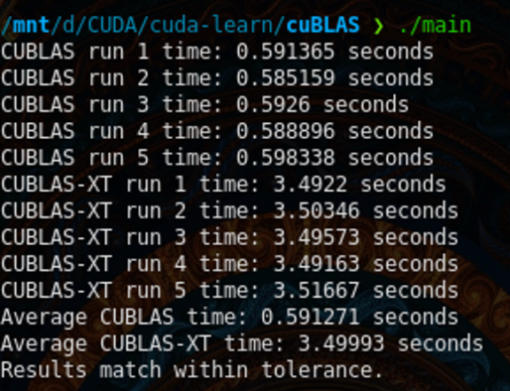
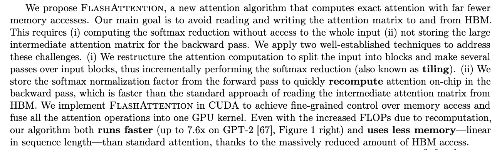

> 注意：在开始之前，一个重要的提醒——在做性能测量时，必须先进行预热（Warmup）和多次基准运行（Benchmark Runs），才能获得准确的执行时间。如果不做任何预热，cuBLAS 的第一次运行会产生大量初始化开销（约 45ms），严重扰乱基准结果。多次基准运行取平均值，才能得到可靠的性能数据。

# cuBLAS

- **NVIDIA CUDA Basic Linear Algebra Subprograms (cuBLAS)** 是 NVIDIA 提供的 GPU 加速线性代数库，用于加速 AI 和 HPC（高性能计算）应用。它提供了一组可直接替换工业标准 BLAS API 的接口，以及高度优化的 GEMM（通用矩阵乘法）API，并支持算子融合（Fusion），针对 NVIDIA GPU 进行了深度调优。
 
- **注意矩阵的存储排布（行优先 vs 列优先）**：cuBLAS 默认使用**列优先（Column-Major）** 存储，而 C/C++ 数组是行优先（Row-Major）的。如果不做转换，矩阵乘法的结果会完全错误。参考：[cuBLAS Sgemm 行优先乘法讨论](https://stackoverflow.com/questions/56043539/cublassgemm-row-major-multiplication)

## cuBLAS-Lt（轻量级扩展）
- **cuBLASLt (CUDA BLAS Lightweight)** 是 cuBLAS 库的扩展，提供了更灵活的 API 接口，主要面向深度学习模型等特定工作负载的性能优化。它几乎所有的数据类型和 API 调用都围绕矩阵乘法（matmul）展开。
- 当单个核函数无法完成整个问题时，cuBLASLt 会尝试将问题分解为多个子问题，并针对每个子问题分别启动内核依次求解。
- **混合精度与低精度计算**：cuBLASLt 是 FP16（半精度）、FP8（8位浮点）和 INT8（8位整数量化）等低精度计算正式发挥作用的地方——通过降低数值精度来换取更高的计算吞吐量和更低的显存占用，是现代大模型推理加速的核心手段。

## cuBLAS-Xt（多 GPU 扩展）
- **cuBLASXt** 支持主机端 + GPU 协同求解的模式，但由于需要在主板 DRAM 和 GPU VRAM 之间频繁传输数据，会遇到**内存带宽瓶颈**，因此速度远慢于纯 GPU 片上计算。
- **cuBLASXt** 是 cuBLAS 的多 GPU 支持扩展，其核心特性包括：

  **多 GPU 并行**：支持将 BLAS 运算分发到多块 GPU 上执行，通过 GPU 水平扩展在大规模数据集上获得显著的性能提升。

  **线程安全**：设计为线程安全的 API，允许在不同 GPU 上并发执行多个 BLAS 操作。

  适合需要跨多块 GPU 分发工作负载的大规模计算场景。当矩阵规模超出单块 GPU 显存容量时，选择 cuBLAS-Xt。

- **cuBLAS vs cuBLAS-Xt 性能对比**：
    - 测试参数：`(M, N) @ (N, K)`，其中 M = N = K = 16384
    - 

## cuBLASDx（设备端扩展，实验性）

**本课程中不使用此库。**

cuBLASDx（预览版）是一个设备端（Device-side）API 扩展，允许直接在 CUDA 核函数**内部**执行 BLAS 计算。通过将多个数值运算融合（Fuse）在同一个核函数中，可以减少核函数启动开销和中间数据的显存读写延迟，进一步提升应用性能。

- cuBLASDx 官方文档：[https://docs.nvidia.com/cuda/cublasdx](https://docs.nvidia.com/cuda/cublasdx)
- cuBLASDx 不包含在 CUDA Toolkit 中，需要单独下载：[cuBLASDx 下载页面](https://developer.nvidia.com/cublasdx-downloads)

## CUTLASS（CUDA 模板线性代数子程序库）
- cuBLAS 及其各变体都是在主机端（Host）调用的闭源库；而 cuBLAS-DX 的文档和优化程度目前还不够完善。
- 矩阵乘法是深度学习中**最核心的基础运算**，但 cuBLAS 不允许我们轻松地将矩阵乘法与其他操作（如激活函数、Softmax、残差加法等）融合在一起执行。
- **[CUTLASS](https://github.com/NVIDIA/cutlass)（CUDA Templates for Linear Algebra Subroutines）** 则正好弥补了这一空白——它是一个开源的 C++ 模板库，允许开发者以高度可定制的方式编写和融合矩阵运算内核（在本课程的 optional 部分也有涉及）。
- 补充说明：Flash Attention 并没有使用 CUTLASS，而是使用了经过手工深度优化的纯 CUDA 核函数（参考下方论文）。
 -> 来源: https://arxiv.org/pdf/2205.14135
