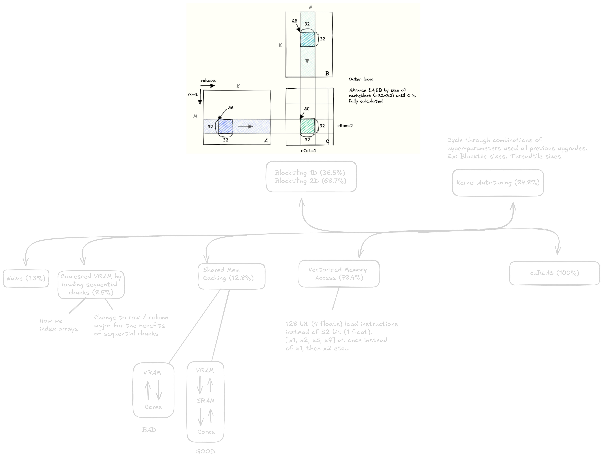

# Lets Optimize Matrix Multiplication



> Naive (easiest to understand but poor performance)
> Coalesced Memory Access (ensuring we load data in a way that is optimal for the GPU)
> Shared Memory (reducing the number of global memory accesses increases memory bandwidth)
> 1D/2D Blocktiling (splitting the work equally amongst all SMs / blocks in the grid)
> Vectorized Memory Access (loading more data per instruction (128 bit instead of 32 bit))
> Autotuning (grid search for the most optimal parameters for your kernel based on the your GPU architecture)
> cuBLAS (NVIDIA's closed source library for linear algebra operations like Matmul)

**I was too lazy to write this so lets jump over to Simon Boehm's [blog](https://siboehm.com/articles/22/CUDA-MMM) & [git repo](https://github.com/siboehm/SGEMM_CUDA)**

## Q&A: Common Questions & Core Concepts
For in-depth explanations of optimization concepts, refer to the [QA.md](QA.md) document:
- [Q1: What is Coalesced Memory Access? Underlying hardware mechanism & optimization laws.](QA.md#q1-什么是全局内存的合并访存-coalesced-memory-access它的底层硬件机理和优化法则是什么)
- [Q2: How did we shift from "Memory-Bound" to "Compute-Bound" in this benchmark?](QA.md#q2-在这个-benchmark-里我们是怎么从内存受限变成计算受限的)
- [Q3: What is Blocktiling? Is it Shared Memory Tiling? (3 levels of Tiling).](QA.md#q3-分块-blocktiling-是什么是-shared-memory-tiling-吗)
- [Q4: What is Vectorized Memory Access (Kernel 6)?](QA.md#q4-向量化访存-vectorized-mem-access-kernel-6-是什么)
- [Q5: What is Double Buffering (Software Pipelining, Kernel 11)?](QA.md#q5-双缓冲-double-buffering--软件流水线-是什么)
- [Q6: How to avoid Shared Memory Bank Conflicts (Padding vs. Swizzling)?](QA.md#q6-如何规避-shared-memory-的-bank-conflict银行冲突)
- [Q7: Explain Thread Coarsening & Vectorization.](QA.md#q7-解释一下-thread-coarsening-与-vectorization线程粗化与向量化)
- [Q8: How is `__shared__` memory array defined and synchronized?](QA.md#q8-shared-memory共享内存数组是怎么定义和同步的)
- [Q9: What is Roofline Model (Attainable Performance vs Arithmetic Intensity)?](QA.md#q9-什么是-roofline-model屋顶线模型如何用它判断-kernel-的性能瓶颈)
- [Q10: What is Occupancy? Underlying resource constraints & trade-offs.](QA.md#q10-什么是-occupancy占用率它和性能是什么关系)
- [Q11: What is the purpose and mechanism of Loop Unrolling (#pragma unroll)?](QA.md#q11-循环展开-pragma-unroll-的作用和原理是什么)
- [Q12: How to profile CUDA Kernels using Nsight Compute (ncu)?](QA.md#q12-如何使用-nsight-compute-ncu-对-cuda-kernel-进行性能分析)


## Row Major vs Column Major

- cuBLAS expects matrices to be in column major format so we have to transpose beforehand
- Row Major: `A[i][j]` is stored in `A[i * N + j]`
- Column Major: `A[i][j]` is stored in `A[j * M + i]`

```python
# Row Major
A = [[1, 2, 3],
     [4, 5, 6],
     [7, 8, 9]]

# how its stored in memory
A = [1, 2, 3, 4, 5, 6, 7, 8, 9]

# Column Major
A = [[1, 4, 7],
     [2, 5, 8],
     [3, 6, 9]]

# how its stored in memory
A = [1, 4, 7, 2, 5, 8, 3, 6, 9]
```

## Purpose of `pragma #unroll`

- ideally, you'd want more useful compute per iteration. if you can do 4 math operations inside of 1 per iteration thats good.
- in some contexts, the compiler will actually will actually unroll the loop without explicitly telling it to do so. (this is what happened with `unrolling.cu`)
- you can check the PTX assembly code with `nvcc -ptx v1.cu -o - | less` to see if the compiler has unrolled the loop.
- by writing a kernel without unrolling and benchmarking it with a kernel that has unrolling, you can see if the unrolling
  is actually beneficial. then check the PTX assembly code to see if the compiler has unrolled the loop. only beneficial if you aren't getting the benefits you wanted and need to investigate further.
- the quickly benchmark, just take the average time of the kernel and compare it to the unrolled version. if the unrolled version is faster, then the unrolling was beneficial. if not, then the unrolling was not beneficial. always make sure to verify results so your kernel is outputting what is should (compare element-wise)

## What is occupancy

    Occupancy is defined as the ratio between the number of active warps per SM and the maximum possible number of active warps per SM.

    There are three main limits to keeping more active blocks loaded on an SM: register count, warp count and SMEM capacity. Let’s do an example calculation for our current kernel.

    https://docs.nvidia.com/cuda/cuda-c-best-practices-guide/index.html#occupancy

> [Matmul Performance](https://docs.nvidia.com/deeplearning/performance/dl-performance-matrix-multiplication/index.html)

## Assembly Instructions:

- [PTX Instructions (Parallel Thread Execution)](https://docs.nvidia.com/cuda/parallel-thread-execution/index.html#ptx-machine-model)
- [How to read Shader Assembly (SASS)](https://interplayoflight.wordpress.com/2021/04/18/how-to-read-shader-assembly/)

### Why might we want to dig into OR write assembly code?

- allows us to understand the operations we are bound by (ex: warp divergence, waiting for data to arrive in registers, time expensive operations, etc)
- allows for clock-cycle optimization (closest to the bare metal you can get)

## Inspired by:

1. [Simon Boehm @ Anthropic](https://siboehm.com/articles/22/CUDA-MMM)
2. [Lei Mao @ NVIDIA](https://github.com/leimao/CUDA-GEMM-Optimization)

## Take it a step further:

- To understand the kernel performance optimizations that companies like NVIDIA apply to the **matmul** in order to achieve high TFLOP counts seen in cuBLAS, check out cuTLASS (CUDA Templates for Linear Algebra Subroutines):
- [CUTLASS Github](https://github.com/NVIDIA/cutlass)
- [CUTLASS Blog](https://developer.nvidia.com/blog/cutlass-linear-algebra-cuda/)
- [CUTLASS Documentation](https://nvidia.github.io/cutlass/)
